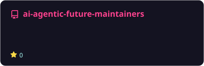
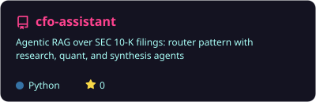
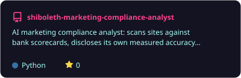
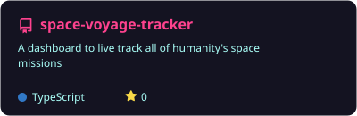

  

# 💫 About Me:
I am an AI Engineer who specializes in building agent runtimes, evaluation pipelines, custom agent harnesses, context engineering, and MCP Servers. Low-key had to figure most of it out on my own, before there were tutorials for it.

- 🔭 Shipping a channel-agnostic, multi-agent AI assistant dispatched from a custom-built platform for spinning up agent runtimes. The assistant lives in a Fortune-20 retail executive's channels (Slack, WhatsApp, email) and automates 151 hours/month of manual work
- 🏦 At Deutsche Bank, built an AI-enabled equity research platform that cut portfolio research time 63% for 15+ investment bankers, influencing ~$5M in portfolio outcomes
- 📏 My rule: an AI system that can't measure itself is a demo, not a product. Everything I ship carries its own eval pipeline
- 🧭 CMU MISM '25 · ex-Deutsche Bank · ex-PwC · fintech roots, agentic present
## 🌐 Socials:
  
# 💼 Where I've Shipped:

**🤖 Virtual Gold** · Technology Consultant, AI Engineer · *Aug 2025 - Present*
Own the full SDLC of a multi-agent AI assistant a Fortune-20 retail board member relies on daily: ~150 exec hours/month saved, ~52% output quality gain via LLM-as-a-Judge evals, ~55% less manual coordination through channel-agnostic agentic workflows.

**🏥 CMU x Allegheny General Hospital** · Research Assistant, AI Software Engineer · *Jun - Aug 2025*
Built a clinical AI assistant adopted department-wide by 70+ ER physicians: source-cited answers with hallucination guardrails in under 1 minute, shipped end to end in 10 weeks.

**🏦 Deutsche Bank** · Senior Analyst, Full Stack Software Engineering · *Apr 2023 - Jul 2024*
Built DB Colors, an AI-enabled equity research platform that cut research time 63% for 15+ investment bankers (~$5M in portfolio outcomes). Compliance platform at ~100K req/sec, 75% API latency cut, 10 design-system components adopted across 40+ apps.

**📈 PwC** · Technology Consultant, Platform Engineering · *Jul 2021 - Jan 2023*
Shipped 10+ features on a loan platform serving 700K+ users worldwide, including a document translation service behind $2.91M in disbursements. Salesforce prototypes built directly with IDFC Bank stakeholders.

# 💻 Tech Stack:

**🧠 AI & Agents**

              

**⚙️ Languages & Backend**

       

**🎨 Frontend & Design**

        

**☁️ Cloud & DevOps**

          

**📊 Data & Analytics**

        

*Also fluent in: ETL, Medallion Architecture, Star Schema modeling, DAX, evaluation systems*

# 🚀 Featured Builds:
*Auto-synced with my pinned repositories, refreshed daily.*

<!-- PINNED:START -->

  
  

  
  

  
  

<!-- PINNED:END -->

# 📊 GitHub Stats:
 
 

## 🏆 GitHub Trophies

---

*The gap between a demo and a product is an evaluation pipeline.*

